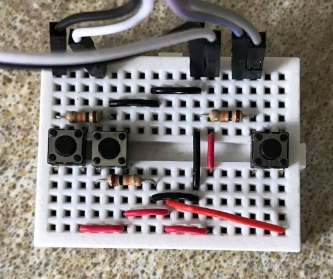

# MEng_Project_Arm

The purpose of this code is to control (and monitor) Dynamixel MX-64AR smart servos. It is designed to work with Arduino Mega (ATmega2560) and MAX485 TTL to RS485 module. The code is based on work by Mark Khordi-Moodi as a part of his dissertation completed in 2018.

## Atmel Studio 7 Setup

1. Connect the Arduino (Mega) to your computer.
2. Install Arduino IDE (if you have not done it yet) and go to `[Tools] => [Port]` to find out what port (COM) is the Ardudino board connected to.
3. Open (install first :) ) Atmel Studio 7. Then go to `[Tools] => [External Tools]`:

    * Titile: `Arduino MEGA COM8` (where `8` in `COM8` is the port number of your COM (see 2))
    * Command: `C:\Program Files (x86)\Arduino\hardware\tools\avr\bin\avrdude.exe`
    * Arguments: `-C "C:\Program Files (x86)\Arduino\hardware\tools\avr\etc\avrdude.conf" -v -p atmega2560 -c wiring -P COM8 -b 115200 -D -U flash:w:"$(ProjectDir)Debug\$(TargetName).hex":i` (where `8` in `COM8` is the port number of your COM (see 2))
    * Initial directory: (leave it empty)

***
### Version 0.34 (10/04/2019)

 * [x] Getting data (load) from ID 4 and 5 at the same time.

##### TODOs
* [ ] control servo 1 and 2 by giving number of turns.
* [ ] rearrange LCD layout (2nd and 3rd row last remove).
* [ ] Inverse Kinematics.
* [ ] Redesign the `PrintDataLCD` function (as separate github branch `Better_Update_LCD_version`).
  * [ ] Pull the servo Data and store it in the `arm` struct in one function and (`updateArmData` function),
  * [ ] Print the Data from `arm` struct to `LCD` or/and to `Serial port` in the next function (`printArmDataLCD` and `printArmDataSerial` fucntions).

### Version 0.33 (03/04/2019)

* [x] Added speed setting to each servo individually. The servos are initiated in `setup` function with best (as we tested) speeds.
* [x] Added buttons (1 and 2) functionality. It now can control the direction and stop servos 1 and 2. [CCW direction/stop][CW direction/stop].
* [x] Fixed UNSTABLE behaviour.

##### TODOs

* [ ] Inverse Kinematics.
* [x] Pressing button `[Select]` (changing servo) stop the current servo movement (as separate github branch `Better_Update_LCD_version`).
* [ ] Redesign the `PrintDataLCD` function (as separate github branch `Better_Update_LCD_version`).
  * [ ] Pull the servo Data and store it in the `arm` struct in one function and (`updateArmData` function),
  * [ ] Print the Data from `arm` struct to `LCD` or/and to `Serial port` in the next function (`printArmDataLCD` and `printArmDataSerial` fucntions).

### Version 0.32 (01/04/2019) - UNSTABLE

* [x] Changed `unsigned char` and `byte` variables to `uint8_t`.
* [x] Changed global variables to global stucts.
* [x] Added `getData` function for requesting and capturing the data (message) returned from (by) the requested servo.
* [x] Added `General.h` and `Arm.h` files.

##### TODOs

* [x] Make it STABLE.
* [ ] Inverse Kinematics.

### Version 0.31 (22/03/2019)

* [x] Added Setups for all the servos and fine-tuned other things.
* [x] Renamed few functions.

### Version 0.3 (22/03/2019)

* [x] The code got optimised (size-wise), from original 683 lines it got reduced to 542 (exluding `MX-64AR.h` file but including lots of comments). This translates to over 20% reduction.
* [x] The 3-Button controller now control all 5 servos. Button `[select]` (3) selects (rotates) between all 5 servos. The other 2 buttons control the direction of the rotation of selected servo, `[down/CCW]` `[up/CW]`  
* [x] Button `[select]` was fixed and now it does not skip servos.

### Version 0.2

* [x] Implemented 3 buttons that control the movement of the robotic arm. The first 2 buttons, `[down]` and `[up]` adjust the angle down and up of the connected segment (link) and the 3rd button, `[select]` toggles between two motors:  
`[down]` `[up]` `[select]`

